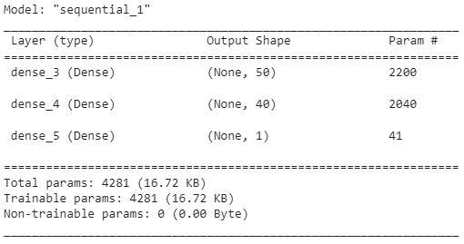
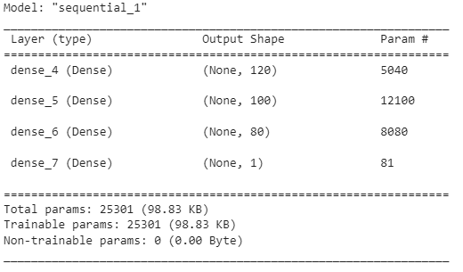

# deep-learning-challenge

## Overview of the Analysis

The purpose of this repository is to create a tool for selecting the best applicants for funding by Alphabet Soup.

For this a supervised Machine Learning Model was trained and evaluated using data from the previous ventures were the campaigns were marked either successful or unsuccessful.

The data comprised 34,299 records with the informations of previous applicants such as Applycation type, Use case for funding, Organization type, Funding amount requested, etc...

A neural network model with a binary target was used and to be able to evaluate the model the data was split into train data and test data, the train data was used to fit the model and then some metrics were calculated using the test data.

It was necessary to train a several versions of the model in order to optimize the results nevertheless the data was to complex and the maximum accuracy score reached was of 73.78% with the version 3 of the model.

## Results

* Data Preprocessing:
  * Target variable: IS_SUCCESSFUL
  * Feature variables:
    * APPLICATION_TYPE—Alphabet Soup application type
    * AFFILIATION—Affiliated sector of industry
    * CLASSIFICATION—Government organization classification
    * USE_CASE—Use case for funding
    * ORGANIZATION—Organization type
    * STATUS—Active status
    * INCOME_AMT—Income classification
    * SPECIAL_CONSIDERATIONS—Special considerations for     application
    * ASK_AMT—Funding amount requested
  * Removed variables:
    * EIN and NAME—Identification columns
    * During the optimization STATUS was also removed as it was redundant with the target

* Compiling, Training, and Evaluating the Model

  * Model version 1 
    * Had two hidden layers with 50 and 40 neurons with a ReLU activation function in both layers

  

       Model v1 test results
       ---------------------------- 
        Accuracy: 73.67% 
        Loss: 0.5587

Several optimization methods were tried:
  * Changing the bins for the CLASSIFICATION and APPLICATION_TYPE variables
  * Dropping the STATUS variable from the data
  * Increase the number of neurons per layer
  * Add more hidden layers
  * Increase the number of epochs during training
  * Loading the weights from the checkpoint of the best performance epoch during training

After running various trails the best performance reached was obtained by the third model.

* Model version 3
    * Had three hidden layers with 120, 100 and 80 neurons respectively with a ReLU activation function in the first two layers and a Tanh in the third one.
    * The weights are not the ones from the last epoch but the ones from the checkpoint. 

  

        Model v3 test results
       ---------------------------- 
        Accuracy: 73.73% 
        Loss: 0.5702

## Summary

The third version of the model had marginally better results compared to other versions of the model, nevertheless the target performance was not achieved.

The data as it stands was too complex for this this kind of model, it would be probably better to try to cluster the types of applicants with a clustering model and then try to return to a nerual network model or a Random Forest model.

